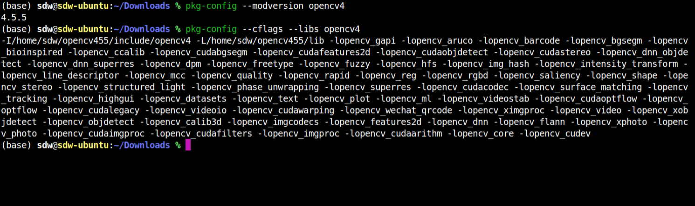
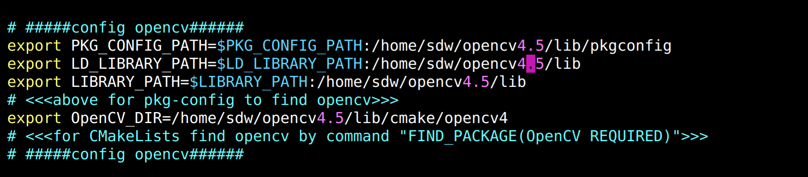
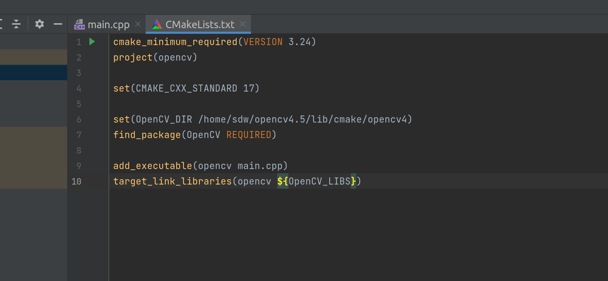

1. **安装**

⾸先先安装⼀切有必要的包裹：

    ```Shell
    sudo apt-get update
    sudo apt-get upgrade
    sudo apt-get install build-essential cmake
    unzip pkg-config
    sudo apt-get install libjpeg-dev libpng-dev
    libtiff-dev
    sudo apt-get install libavcodec-dev
    libavformat-dev libswscale-dev
    sudo apt-get install libv4l-dev libxvidcore-
    dev libx264-dev
    sudo apt-get install libgtk-3-dev
    sudo apt-get install libatlas-base-dev
    gfortran
    sudo apt-get install python3-dev
    ```

2. **下载OpenCV源代码**

接下来我们下载OpenCV的源代码。这是因为如果要配置CUDA⽀持，OpenCV并没有提供现成直接安装的包裹
（C++版也是如此，不像Python的能直接pip install），我们必须先下载源代码，然后cmake编译后安装。

1.进⼊OpenCV Github Release⽹⻚：
    [https://github.com/opencv/opencv/releases](https://github.com/opencv/opencv/releases)
    
2.选择你想要的版本，我选择了最新的4.4.0.  


3.接下来轮到OpenCV-contrib：选择⼀样版本的contrib（不⼀样版本后果自负哈）
[https://github.com/opencv/opencv_contrib/releases](https://github.com/opencv/opencv_contrib/releases)

3. **解压**

在home下打开终端。加上从上⾯拿到的两个链接，通过以下命令，我们能下载OpenCV的源代码并解压:

    ```Shell
    cd ~
    wget -O opencv.zip
    https://github.com/opencv/opencv/archive/[你的版本号].zip
    wget -O opencv_contrib.zip
    https://github.com/opencv/opencv_contrib/archive/[你的版本号].zip
    unzip opencv.zip
    unzip opencv_contrib.zip
    mv opencv-[你的版本号] opencv
    mv opencv_contrib-[你的版本号] opencv_contrib
    ```

4. **选择编译**

    使⽤cmake-gui，选择unix makefiles, 然后根据视频把不需要的项⽬取消掉，主要有:opencv_face, opencv_world，所有test，opencv_xfeature2d,opencv_stitching。记得把**OPENCV_GENERATE_PKGCONFIG** 这个勾选上，要不然没法查看Opencv版本，还得⾃⼰创建。

    [https://www.bilibili.com/video/BV1Rp4y1a7cm?spm_id_from=333.999.0.0&vd_source=4fb36de1266349e65e8682fb847af8ee](https://www.bilibili.com/video/BV1Rp4y1a7cm?spm_id_from=333.999.0.0&vd_source=4fb36de1266349e65e8682fb847af8ee)

5. **编译**

    ```Shell
    编译make -jx,x是CPU核数，随便写⼀个也可以。例如：8
    ```

6. **安装**

    ```Shell
    编译成功后我们就可安装：
    sudo make install
    sudo ldconfig
    ```

7. **验证**

    注意加 4



    · **PKG_CONFIG作用**

    一般我们写的程序都是要依赖一些库，但库的安装位置可能不同，这就需要一个工具能够管理并能搜索这些库的路径（头文件路径 `/include`，库文件路径 `/lib`）。

    `pkg-config` 就是通过库提供的一个 `.pc` 文件获得库的各种必要信息的，包括版本信息、编译和连接需要的参数等。通过 `pkg-config` 提供的参数`–cflags, –libs`，将所需信息提取出来供编译和连接使用。这样，不管库文件安装在哪，通过库对应的 `.pc` 文件就可以准确定位。

    它提供的主要功能有:

    - 检查库的版本号。如果所需库的版本不满足要求，打印出错误信息，避免连接错误版本的库文件；

    - 获得编译预处理参数，如宏定义，头文件的路径；

    - 获得编译参数，如库及其依赖的其他库的位置，文件名及其他一些连接参数；

    - 加入所依赖的其他库的设置

    **· PKG_CONFIG_PATH**

    `pkg-config` 默认会搜索 `/usr/lib/pkgconfig` 和`/usr/share/pkgconfig`下的 `.pc` 配置文件，若我们源码编译的库的路径不在 `pkg-config` 的默认搜索路径下，则可以通过环境变量 `PKG_CONFIG_PATH` 将自定义的路径添加到 `pkg-config` 的搜索路径。

    

#### 最终配置图





8. **测试**

    - 创建新⽂件夹，我命名为OpenCV-Test

    - 进⼊⽂件夹后右键打开终端

    - touch main.cpp 创建名为main.cpp的⽂件

    - 右键main.cpp，使⽤IDE打开

    - 复制代码：
    ```C++
    #include <opencv2/opencv.hpp>
    #include <iostream>
    using namespace cv;
    using namespace std;
    int main(int argc, char** argv)
    {
    //读取照⽚
     Mat image = imread("OpenCV_Logo.png");
    //检测失误
    if (image.empty())
    {
        cout << "Could not open or find the image"<< endl;
        cin.get(); //等待键盘输⼊
        return -1;
    }
     String windowName = "OpenCV Test";
    窗⼝名称
    namedWindow(windowName);
    创建新窗⼝
    imshow(windowName, image);
    使⽤新窗⼝显⽰照⽚
    waitKey(0);
    等待键盘输⼊
    destroyWindow(windowName);
    关闭所有窗⼝
    return 0;
    }
    ```